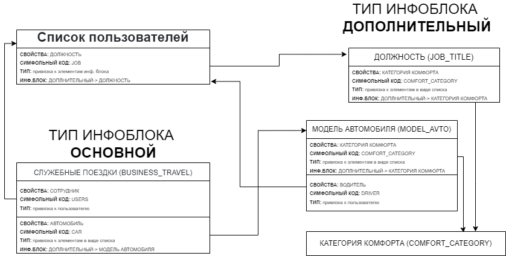
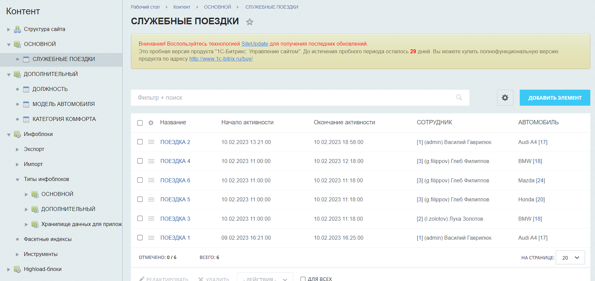
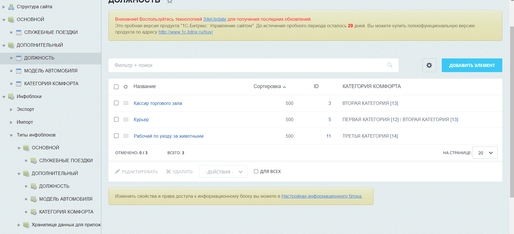
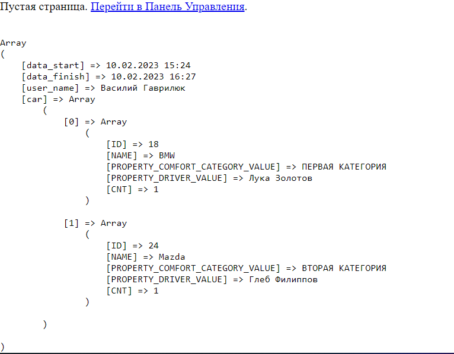

# Задача
В компании предусмотрена возможность выбора служебного автомобиля для служебной поездки на определенное время из не занятых другими сотрудниками. В служебной части корпоративного сайта необходимо будет размещать актуальную информацию о доступных для конкретного сотрудника автомобилях на запланированное время поездки.
Дополнительные условия:
- каждая модель автомобиля имеет определенную категорию комфорта (первая, вторая, третья... );
- для определенной должности сотрудников доступны только автомобили определенной категории комфорта (одной или нескольких категорий);
- за каждым автомобилем закреплён свой водитель.

Необходимо:
1. Спроектировать структуру админинистративного раздела управления контентом (инфоблоки/хайлоадблоки, их свойства и связи), составить в любом редакторе (с возможностью экспорта в  jpg, png, pdf или просмотра в браузере) диаграмму связей;
    
        файл: bitrix-component_car.drawio

2. Написать компонент, который выводит для текущего сотрудника список свободных автомобилей на запрошенное время (запрошенное время начала и время окончания поездки передается от клиента на сервер в get-параметрах) с указанием модели, категории комфорта, водителя - шаблон c html-разметкой (template.php) делать не нужно.

    get-запрос след. вида: ?data_start=d.m.Y H:i:s&data_finish=d.m.Y H:i:s

